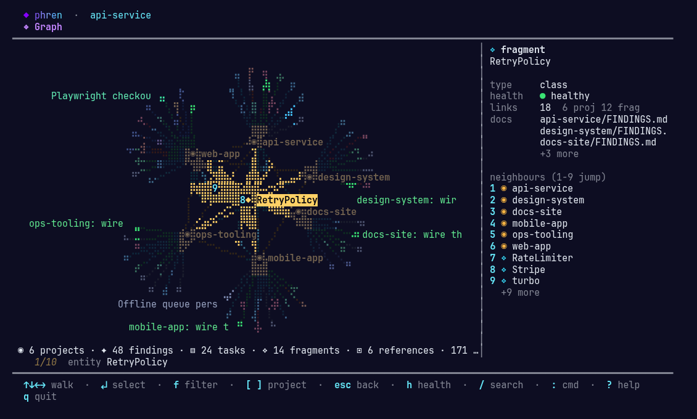

<p align="center"></p>

<h3 align="center">Your agents forget everything. Phren doesn't.</h3>

<p align="center">
  <a href="https://www.npmjs.com/package/@phren/cli"></a>
  <a href="https://github.com/alaarab/phren/blob/main/LICENSE"></a>
  <a href="https://alaarab.github.io/phren/"></a>
  <a href="https://alaarab.github.io/phren/whitepaper.pdf"></a>
</p>

<p align="center">
Persistent memory for AI agents. Findings, tasks, and patterns live in markdown files in a git repo you control. No database, no vendor lock-in. Works with Claude, Copilot, Cursor, and Codex — and you can browse the same store from a terminal shell, a 3D web graph, VS Code, an iOS app, or a Herdr pane.
</p>

<p align="center"></p>

---

## Install

```bash
npx @phren/cli init
```

One command. Sets up `~/.phren`, wires up MCP for your tools, installs hooks. Next time you open a project, context starts flowing automatically. On a new machine? Re-run init and you're back in sync.

---

## What actually happens

**When you open a prompt:**
- Hooks extract keywords from your question
- Phren searches findings across projects (FTS5 full-text with semantic fallback)
- Relevant snippets inject into your prompt before you hit send
- You ask; Claude already knows the gotchas

**When you discover something:**
- `phren add-finding <project> "finding text"` captures it with optional tags (`[decision]`, `[pattern]`, `[pitfall]`, `[bug]`)
- Trust scores decay over time; decisions never do; observations expire in 14 days
- Findings link to fragments (named concepts like "auth" or "build") that connect knowledge across projects

**Sessions:**
- Mark boundaries with `session_start` / `session_end`
- Next session sees your prior summary, active tasks, recent findings, and where you left off
- Checkpoints track edited files and failing tests so you can resume exactly where you stopped

**Tasks:**
- Add with priority/section. Pin across sessions. Link to GitHub issues.
- Track completions and cross-project rollups.

---

## Interfaces

One store, six ways in. Every surface reads and writes the same markdown files, so nothing you do in one is invisible to the others.

| Surface | Open it | What it is for |
|---------|---------|----------------|
| **Terminal shell** | `phren shell` (or just `phren`) | Full-screen dashboard: projects, tasks, findings, review queue, skills, hooks, health. Deep-link with `--view tasks --here`. |
| **Terminal graph** | `phren shell --view graph`, or `g` in the shell | The knowledge graph drawn on a braille canvas: walk it with the arrows, `/` to search and fly, `[ ]` to focus a project, `1`–`9` to jump to a neighbour. Watches live, so nodes light up as phren reads and writes them, and shows the coding agents running on your machine. |
| **Web UI** | `phren web-ui` | The 3D memory viewer: projects as containment fields, findings/tasks/fragments inside, a contents pane to review, edit, merge, and prune. |
| **VS Code** | `phren-vscode` from the Marketplace | Sidebar tree for everything phren holds, the same 3D graph as a webview, `Ctrl+Shift+K` search. |
| **iOS app** | `apps/ios` (SwiftUI, GitHub sign-in) | Findings, notes, tasks, and the review queue on your phone, live against the store repo. Serverless: it talks to the GitHub REST API only. Widgets and Siri intents included. |
| **Herdr plugin** | `herdr plugin install alaarab/phren/integrations/herdr` | A keybinding that pops the shell over your Herdr layout for whatever project the pane is in. |

The shell opens with a short splash: the phren mascot beside the wordmark, which is revealed with a decrypt text effect on the first launch of a new version and shimmers while it waits for a key.

### Watch it work

Put the graph in one terminal and an agent in another. Every memory a search lands on, every memory a hook injects, and every finding written is appended to a log the graph tails: the node pulses, the camera flies to it, the finding's full text fills the pane, and the event joins an activity feed. Writes show in green so saving is as visible as reading.

With `PHREN_FEATURE_AGENTS=1` the graph also shows **who** is doing it. phren asks whatever is already running your agents — a [Herdr](https://herdr.dev) workspace, `phren-agent --multi` — and joins each one onto a project by the directory it is working in. `Tab` cycles them, `↵` brings one to the front in its own host. Any tool that can print a small JSON record is a provider, so tmux or Zellij users need a few lines of shell rather than a change to phren.

### Install it as a Claude Code plugin

If you would rather install phren the way you install everything else:

```
/plugin marketplace add alaarab/phren
/plugin install phren@phren
```

That brings the five `phren-*` slash commands, the MCP server, and the session hook, all version-pinned and removable with `/plugin uninstall`. `phren init` still does more — it creates the store and wires Copilot, Cursor and Codex too — so a reasonable split is `init` once for the store, the plugin for the Claude Code wiring. See [docs/claude-code-plugin.md](docs/claude-code-plugin.md).

There is also an **experimental coding agent**, `phren-agent`, in [`experimental/agent`](experimental/agent): a standalone binary (not published, not wired into `phren`) that starts every session already knowing the project's gotchas, tasks, and decisions. It opens with the same splash. See [docs/agent.md](docs/agent.md).

---

## Key features

### Fragment graph
Explore connections visually, in the browser or in the terminal. Drag nodes to reorganize in the web UI; the terminal layout is deterministic so the same store always draws the same map. Click a fragment to see every finding linked to it across all projects. The terminal graph also draws edges the browser does not: fragments co-mentioned by the same documents, and `supersedes` / `contradicts` links between findings.

### Finding lifecycle
- **Supersede**: "Finding X is obsoleted by finding Y"
- **Retract**: "We were wrong about this; here's why"
- **Contradict**: "We have two findings that conflict; this is why"

Helps you reason about contradictions instead of hiding them.

### Multi-agent support
Same store works with Claude Code, Copilot, Cursor, and Codex. Agents tag findings with their tool, so you see who discovered what.

### Review queue
Mark findings as needing review (`[Review]` section). Phren surfaces review items on every session start. Approve, reject, or edit in place.

### Governance & policies
Per-project retention policies. Confidence decay curves. Access control. Audit logs. Configure with `phren config` or the web UI.

### Store subscriptions
Subscribe to specific projects in a team store — others stay hidden from search and context injection:
```bash
phren store subscribe team-store arc intranet
phren store unsubscribe team-store legacy-projects
```

### Progressive disclosure
Enable `PHREN_FEATURE_PROGRESSIVE_DISCLOSURE=1` to get compact memory indices instead of full snippets. Call `get_memory_detail(id)` to expand only what you need.

### Semantic dedup & conflict detection
Optional: enable LLM-based duplicate detection and contradiction flagging on `add_finding`. Prevents near-duplicate entries and catches "always use X" vs "never use X" contradictions.

### Skills & hooks
Drop custom slash commands into `~/.phren/global/skills/`. Hooks run on user prompt, tool use, and session events — wire phren into your own workflows.

### Herdr plugin
Working inside [Herdr](https://herdr.dev)? `herdr plugin install alaarab/phren/integrations/herdr` binds the dashboard to a key: tasks, findings, and the review queue for whatever project the pane is sitting in, popped over your layout and gone again when you close it. See [integrations/herdr](integrations/herdr).

### iOS app
[`apps/ios`](apps/ios) is a native SwiftUI app: sign in with GitHub, pick your store repo, and review what your agents learned from your phone — findings, daily notes, tasks, and the review queue, refreshed within seconds of a hook pushing a commit. Home Screen and Lock Screen widgets, and "Hey Siri, add a task to phren". No backend: the token stays in the Keychain and the app talks to GitHub directly.

---

## CLI quick reference

`phren` has 59 registered commands: 40 you will use (setup, projects, core, skills, hooks, config, maintain, stores, team) and 19 internal ones that hooks and background jobs call. `phren --help` prints the cheat sheet; `phren help <command>` the details.

```bash
phren                                   Interactive memory shell
phren search <query>                    Full-text search with FTS5
phren add-finding <project> "insight"
phren note add <project> "daily note"  Add a lightweight daily note
phren task add <project> "item"         Add a task
phren session_start <project>           Start a session
phren store list                        List personal + team stores
phren team init <name> --remote <url>
phren team join <url>                   Join a team store
phren shell --view tasks --here         Open the shell on this project's tasks
phren shell --view graph                Walk the knowledge graph in the terminal
phren web-ui [--port 3499]              Launch the web UI (3D graph, dashboard)
phren doctor                            Health check & auto-fix
```

See full CLI docs at [alaarab.github.io/phren](https://alaarab.github.io/phren/).

---

## Team stores

Shared knowledge repos for teams. One person creates with `phren team init`, others join with `phren team join`. Findings, daily notes, tasks, and skills sync across team members.

Each team store can be configured with per-project subscriptions so people only see what they care about.

---

## Platforms

Agents that write to the store:

- **Claude Code** (VS Code, Web, Desktop) — MCP hooks + CLI
- **Copilot** (VS Code, GitHub.com) — MCP hooks
- **Cursor** (IDE) — MCP hooks + built-in skill system
- **Codex** (Claude Agent SDK) — MCP tools + hooks

Ways to read it: the terminal shell and graph, the web UI, the VS Code extension, the iOS app, and the Herdr plugin (see [Interfaces](#interfaces)).

All use the same phren store. No vendor lock-in.

---

## Packages

| Package | Description |
|---------|-------------|
| [`@phren/cli`](packages/cli) | CLI, MCP server, data layer (59 commands, 59 MCP tools, FTS5, hooks), the interactive shell and terminal graph, the web UI |
| [`phren-vscode`](packages/vscode) | VS Code extension (sidebar, graph, onboarding) |
| [`apps/ios`](apps/ios) | phren for iOS: native SwiftUI app + widgets + Siri intents (not on npm; built with XcodeGen) |
| [`integrations/herdr`](integrations/herdr) | Herdr plugin: keybinding → `phren shell --here` in a pane |
| [`experimental/agent`](experimental/agent) | `phren-agent`, an experimental coding agent with phren memory (unpublished) |

---

MIT License. Made by [Ala Arab](https://github.com/alaarab).
