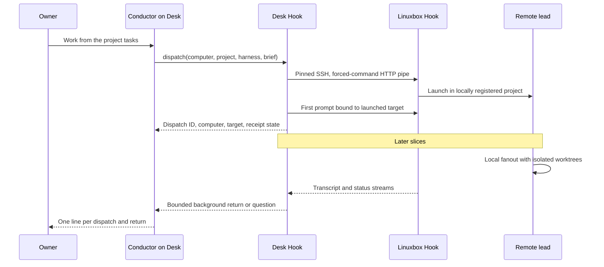

# Conductor

Status: architecture decided; enrollment and dispatch are the first implementation
slice. Reports, remote tree rows, phone routing, and headless workers are specified
below for separate workers. `accepted` means the Hook accepted the first prompt;
it does not mean the worker finished, tests passed, or changes were merged.

## Operating model

The owner talks to one Claude or Codex conversation, the conductor. It reads the
project's Phren tasks, picks independent work, and sends five to ten briefs across
connected computers as capacity permits. Each remote lead owns its local fanout,
checkouts, provider limits, tests, and cleanup. The conductor owns integration
order and the final verification and shipment within the owner's authorization.
Dispatch itself never commits, merges, pushes, or grants additional permissions.

The standing brief ships at
`packages/cli/starter/global/skills/conductor/SKILL.md`. Its chat is a dispatch log:

```text
Linuxbox: parser checks sent to Codex (configured default); report due 14:20 PT.
Desk: navigation checks returned; tests passed; not merged.
Desk: integration verified; tests passed; merged.
```

Briefs carry the engineering details: task IDs, base revision, owned files,
acceptance criteria, permitted commands, forbidden side effects, local fanout
budget, report deadline, and how to return reviewable changes. The one-line chat
does not carry code, diffs, or implementation narration. A deadline is the lead's
next report time, not a completion guarantee. The API does not invent an ETA.



## Trust and enrollment

Every dispatching computer has one ed25519 key, mode 0600, named
`id_ed25519_dispatch` under `PHREN_BRIDGE_HOME` (default
`~/.local/share/phren/bridge`, mode 0700). It stays outside the synced store.
Enrollment reuses this identity; it never silently rotates it. The computer name
is a human alias, not a credential. `anywhere` is reserved.

On Desk, `phren bridge enroll-computer Desk` creates or reuses that key and prints
one `authorized_keys` line. Save the output as `Desk.pub`, transfer it through an
existing trusted channel, and run on Linuxbox:

```sh
phren bridge enroll-computer Desk --accept Desk.pub
```

The accept side validates the SSH ed25519 wire key, reconstructs the restrictions,
preserves unrelated keys, and accepts an identical enrollment idempotently. A
changed key under the same name, or the same key under a different enrollment,
requires explicit revocation first. Symlink key files are refused. Lock directories
prevent concurrent Phren enrollment; a stale lock after a crash requires local
inspection. Concurrent non-Phren edits to `authorized_keys` remain a same-user
administration concern; a pre-replacement comparison detects ordinary conflicts.

The printed line is:

```text
restrict,pty,command="sh ~/.local/share/phren/bridge/dispatch" ssh-ed25519 <public-key> phren-computer:Desk
```

The installed dispatcher remains at the phone's fixed entry path and pins the
configured runtime paths. This slice chooses print/transfer/accept over automatic
SSH installation. An ordinary SSH login can transfer the public file and invoke
the accept command; dispatch credentials are never used to rewrite enrollment.
Neither command enables SSH or installs the Hook implicitly.

The receiver's SSH daemon authenticates the caller's key. Tailscale supplies
private reachability, not application identity. The sender independently pins the
receiver's ed25519 SSH host key. Obtain that public host key and verify its
fingerprint through an already trusted login or the receiver's console. Dispatch
never uses trust-on-first-use, `ssh-keyscan` as verification, passwords, an SSH
agent, or a user's SSH proxy/configuration. A changed pin stops the connection.
Remove `phren-computer:Desk` from the receiver's `authorized_keys` to revoke Desk;
close existing SSH sessions too when immediate revocation is needed.

This is the phone's existing authority, **not a dispatch-only sandbox**. An
enrolled computer can start agents, read exported conversations, operate the
Hook's existing routes, attach existing Herdr terminals, open a project shell,
and reach any loopback TCP service through the allowlisted web relay. Agents and
project shells run with the receiver account's permissions, so a compromised
sender can cause arbitrary actions as that account. Do not describe the key as
read-only or unable to read account-accessible secrets.

The key cannot request generic SSH forwarding (including Unix sockets), agent or
X11 forwarding, an arbitrary SSH exec command, or bypass target validation on
Hook routes. It does not independently grant root, a different account, or trust
on another computer where it is not enrolled. Route guards are narrower than the
overall account authority. Local same-user processes and local store/config files
remain trusted, as they do for phone connections. Enrollment is directional;
Linuxbox does not need a key on Desk to return a transcript Desk is following.

## Peer directory and transport

Use Hook-local `hooks.yaml`, mode 0600, version 1. `machines.yaml` continues to
map machines to Phren profiles; it is not a verified SSH address book. Phone
enrollment records live in its own keychain, so the computer cannot reuse them.
Do not sync private keys, peer addresses, host pins, or dispatch receipts through
the knowledge store.

```yaml
version: 1
computers:
  - name: Desk
    address: desk.example
    username: sam
    port: 22
    server: default
    hostKey: "ssh-ed25519 <verified-public-host-key>"
```

Replace the illustrative host key before use. Names are unique, at most 100
characters using the Hook server-name alphabet. Addresses are literal DNS names
or IP addresses, not SSH aliases or command strings. At most 32 peers and 64 KiB
of configuration are accepted. Only ed25519 host pins are supported initially.
The first slice opens one bounded OpenSSH process per HTTP request with
`phren-hook v1 pipe`, a private temporary known-hosts file, strict checking,
no multiplex reuse, and no forwarding. Briefs go to stdin, never SSH arguments.
Cleanup closes the pipe and removes its temporary pin file. Reports will add a
shared connection/channel abstraction comparable to the phone's
`GatewayConnections` (eight channels, 90-second idle eviction).

## Dispatch contract

`POST /v1/dispatch` on the **local** Hook:

```json
{
  "computer": "Linuxbox",
  "project": "phren",
  "harness": "codex",
  "model": "configured-model",
  "prompt": "A complete worker brief",
  "label": "Parser checks"
}
```

Required fields are `computer`, `project`, `harness`, `prompt`, and `label`.
`model` is optional; omission uses the receiving harness's configured default.
Harnesses are `codex`, `claude`, and `opencode`; Copilot is left out until its
dispatch model/report contract is tested. Prompts are capped at 32768 characters
with the prompt route's control-character rules; labels/models at 200. Unknown
fields, paths as projects, and caller-supplied checkout paths are refused.

1. Validate the request, peer configuration, and dispatch key. Only one dispatch
   is placed at a time per originating Hook; another receives 429. This makes
   consecutive `anywhere` samples useful and bounds outbound launch pressure.
2. Read `/v1/dispatch/capacity` over pinned SSH. It returns product/protocol,
   running Herdr server names, and the count of working agent panes across all
   those servers. A named computer must answer and have its configured server.
   `anywhere` probes configured peers, ignores unreachable/incompatible peers,
   picks the fewest working agents, and breaks ties by computer name. It is a
   point-in-time heuristic, not a distributed capacity reservation. An idle
   just-launched agent may not count until Herdr marks it working. Local leads
   still enforce their provider budgets.
3. Persist a `launching` receipt **before** a mutation. Call the receiving Hook's
   `/v1/workspaces/launch?server=...` with `{project, kind, model?, label}`.
   That Hook reads `<store>/<project>/phren.project.yaml`, requires an absolute
   `sourcePath`, resolves it with `realpath`, and requires an existing directory.
   Project registration on that computer is the authorization for this path;
   there is no fallback to the sender's path, home, or a similarly named folder.
   This overload is exclusive with the existing phone `cwd` field. Existing
   phone launches retain their directory checks. Store sync does not translate
   `sourcePath`: keep registrations correct locally; a stale path fails closed.
4. The existing launch limiter applies (one active launch, six per minute), and
   Herdr creates a fresh workspace. Launch returns its existing fields plus
   `target`: a full session target, or a terminal/process-bound starting target.
5. Persist `sending` and that target, then call the remote `/v1/prompt` once.
   Starting targets use the existing first-prompt branch; if the harness already
   has a session, use the normal session-bound branch. No target is inferred
   from a folder or the newest transcript. A missing target is uncertain.
6. Persist and return `{ok, id, computer, project, harness, model?, label,
   createdAt, updatedAt, state, target?, error?}`. A confirmed Hook acceptance
   produces `accepted`; `deliveryUncertain`, a lost acknowledgement, invalid
   remote binding, or ambiguous launch failure produces `uncertain`. A definite
   pre-launch rejection (400, 404, 429) is `failed`. No automatic mutation retry,
   fallback computer, or workspace deletion follows a partial launch.

Preflight failures use HTTP 400/403/404/409/429/503. Once a receipt exists,
placement outcomes use HTTP 200 with `ok: false` for failed/uncertain, preserving
the ID and any known target. Even an HTTP error during the final local save may
follow successful remote delivery: inspect status before issuing a new dispatch.
The local CLI/MCP request has a 180-second deadline; remote reads have 15 seconds
and remote mutations 65 seconds. A receiver uses the normal 45-second launch
readiness budget. Receiving Hooks need this slice's capability; older Hooks fail
preflight instead of accepting an unsafe compatibility path.

CLI:

```sh
phren dispatch anywhere phren --harness codex --label 'Parser checks' --prompt 'A complete worker brief'
phren dispatch status
```

CLI outputs JSON receipts and exits nonzero on failed or uncertain placement.
The MCP module registers `dispatch` in the full profile and exposes it as
`phren_admin(action: "dispatch", ...)` in core. The core ten-tool list stays
unchanged. Both clients call the local Hook; neither forks a remote agent itself.

`GET /v1/dispatch` and `phren dispatch status` list local receipts, newest first.
The first slice stores mode-0600 JSON under `bridge/dispatches/<uuid>.json`, omits
prompts, caps admission at 1024 files, and requires explicit archival when full.
Interrupted `launching`/`sending` records read as `uncertain`, including during an
in-flight status read. There is no claim of live worker status yet. Later reports
will add bounded retention and distinguish active operations from restart recovery.

## Reports and questions: next contract

Reports require an explicit validated parent, not an inferred latest session.
The extension adds `parent: {provider, session, computer}` and `parentTarget`
(the complete local session target) to the request and receipt. The Hook checks
that provider/session match the live local target and that computer is its own
configured identity before accepting the relation. CLI uses explicit parent
flags; MCP uses explicit arguments until its host supplies trusted session
context. Missing parents remain usable as detached dispatches with status only.
A receiving lead's brief carries dispatch ID and parent identity for local fanout
attachment. Runtime `computer-id` from verified health is the durable machine
identity; aliases only label it. Persist that ID on the outbound receipt.

The origin follows `/v1/transcripts` and `/v1/status` through the remote Hook.
Promote a starting target to a session only through the exact launched pane and
its starting binding; never adopt a replacement pane occupant. `TranscriptReader`
already removes private reasoning and provides bounded public pages. Capture the
last public assistant text at a provider's terminal turn event (Codex completed
turn, Claude end-turn, OpenCode `end_turn`). A tool step, idle pane, disconnect,
or question is not completion. Bound the report to 4000 UTF-8 bytes and store the
truncation flag and a transcript reference for full inspection.

Deliver a background row to the conductor using the Claude task envelope:

```xml
<task-notification>
<task-id>dispatch-id</task-id>
<tool-use-id>dispatch:dispatch-id:turn-id</tool-use-id>
<status>completed</status>
<summary>Linuxbox: parser checks returned; tests passed; not merged.</summary>
</task-notification>
```

XML-escape remote text; use the existing allowlist (summary at most 500
characters, other fields 200). The stored report can be larger than the chat
preview. Claude's queue exporter produces `type: system`, `phrenBackground: true`,
with a user-role string-content envelope. `agent-hooks.ts` watches lifecycle and
delivery, but does **not** currently provide a background enqueue API. The report
worker must implement and prove a conversation-bound delivery adapter, not append
to a provider's transcript file or paste text and call it a background event.
For Codex, use the exact-thread inbox when available and a separate public
background event projection so it also renders as Background. If a harness has
no safe background inbox, retain `reportPending` and show status; never silently
substitute a user bubble.

Checkpoint by dispatch ID + remote turn ID and persist an outbox before delivery.
Mark a transport-ambiguous enqueue `deliveryUncertain`; do not replay it. On
reconnect, dedupe backlog rows and resume read cursors with exponential backoff
up to 60 seconds. Cap streams to eight per peer and 16 total; queue extra watches.
Restore watches after restart without relaunching workers. Finished reports and
receipts retain for 30 days, capped at 256 MiB; active/uncertain work is never
silently discarded. `completed` means a turn finished, not that tests or merge
succeeded. Those claims remain explicit `unknown` until the lead supplies evidence
and the conductor verifies integration. A stalled lead gets a report deadline
reminder, not another copy of its task.

Questions surface as a Background notification with computer, brief, exact target,
question/call ID and available actions. Forward the phone's existing contracts:

- Codex async questions: `/v1/questions/answer`, original `toolUseId` and one
  `answers` item per question, with `optionIndexes` or typed `text`.
- Claude watched `AskUserQuestion`: `/v1/approvals/answer`, exact `actionId`,
  `decision`, original input plus `answers` keyed by question text. Do not rewrite
  the question, infer a choice, or auto-approve a permission request.
- Terminal questions: `/v1/keys` with the same bounded answer-key list the phone
  uses (`Escape`, `Enter`, `Up`, `Down`, `Tab`, `y`, `n`, `1` through `9`). Starting
  targets retain their starting token. Secrets stay in the existing protected
  input path; do not relay them through report text.

The owner can answer through the conductor or open the phone's existing remote
chat. Revalidate target and pending question on answer; honor durable uncertain
answer receipts. Synchronous Codex questions retain the phone's unsupported
terminal-only behavior until there is a verified provider API.

## Identity in the work tree

The origin's dispatch receipt is authoritative for the cross-computer relation.
Do not fabricate a local transcript path for a remote child. Extend public child
rows with `computer: {id, name}` and `remote: {target, child?}`. A remote lead uses
its full session target; one of its local fanout descendants uses that lead's
target plus the remote parent-scoped child ID. Generate displayed child IDs from
local parent provider/session + remote computer ID + dispatch ID + descendant ID.
Key cycle detection by computer + provider + session, with the existing depth-4
and 128-node bounds. Do not merge unrelated sessions sharing a folder or label.

Fanout manifests extend their optional parent to
`{provider, session, computer?}`; legacy manifests still work. Their current
strict schema must explicitly permit the new field. The wrappers' established
`id/provider/taskLabel/cwd/worktree/model/eventLog/timestamps/status/parent`
contract stays intact. Workers remain children of their local lead; the remote
lead is the conductor's child. `/v1/subagents` validates the conductor's target
before returning any remote descriptors. Local-child routes continue to validate
the local parent; they must not interpret a remote descriptor as a file path.

The phone maps the row's immutable computer ID to an already enrolled connection,
shows a computer chip, and opens transcript/history/diff/questions through that
computer's Hook using its own device key. It does not inherit Desk's trust or
connect to an address supplied in a child row. An unknown computer offers normal
enrollment; an offline one keeps the row with an unavailable state. See
[the phone design](../apps/ios/design/conductor.md).

## Failure behavior

| Failure | First slice | Follow-on behavior |
| --- | --- | --- |
| Offline or sleeping peer | Named dispatch errors; `anywhere` excludes it | Backoff watches, retain last report; no relaunch |
| Key not enrolled or host pin changed | Refuse connection; no password/agent fallback | Owner repairs enrollment or verifies a new pin locally |
| Unknown or missing project/sourcePath | Remote 404; failed receipt; no workspace | Remote `phren add`/registration repair, never clone implicitly |
| Herdr unavailable | Preflight 503 explaining headless is not installed | Remote headless adapter below |
| Harness absent, startup trust prompt, rate limit | Preserve partial workspace; fail/uncertain receipt | Surface startup question, no unbound paste or automatic retry |
| Launch or prompt acknowledgement lost | Uncertain receipt, known target retained | Reconcile from receipt and identity, never dispatch twice automatically |
| Worker asks a question | Inspect through existing remote chat | Background question plus existing exact answer contract |
| Conductor exits or Hook restarts | Receipts survive, in-flight state uncertain | Restore transcript watches/outbox; no worker restart |
| Model/account rate limit | Provider's result remains on remote computer | Lead reduces local fanout; no unrequested OpenRouter spending |

When Herdr is absent, the remote Hook must eventually launch a durable headless
lead through the installed fanout wrapper, not the forced-command PTY shell
(which dies on disconnect and has no chat identity). Use
`scripts/run.sh --provider codex|opencode --label ... --worktree ... [--model ...]
[--mode ...]` with an isolated checkout and the brief on stdin. Require a known
installed wrapper path and validated argv; do not accept a shell command/path
from the origin. If wrappers are absent, return an actionable 503. Claude has no
headless wrapper in this contract, so require Herdr or an explicitly chosen
supported harness. A headless dispatch uses a manifest handle, never a fabricated
Herdr target; advertise a new capability and a discriminated result before use.

## Work packages

These briefs share the contracts above. The first slice fixes the base API;
workers B through E can develop against fixtures concurrently. One integrator
owns edits to shared `server.ts` route wiring after their modules pass checks.
No worker changes another worker's files. A worker returns the base revision,
changed paths, test commands/results, blockers, and reviewable changes; it does
not merge another worker's output.

### A. Enrollment and placement (this slice)

Files: `packages/cli/src/bridge/{computers,peers,client,dispatch,dispatch-command}.ts`,
`bridge/{server,command,bridge.test}.ts`, `tools/dispatch.ts`, `cli-registry.ts`,
`index.ts`, their new tests, API docs, changelog, and the starter skill.

Contract: restricted print/accept enrollment, out-of-band host pins, remote-only
project resolution, one first prompt, durable placement receipts, named/anywhere
scheduling, CLI and both MCP profiles. No reports, remote tree, phone changes,
headless execution, or automatic integration claims.

Tests: generated temporary keys/permissions/idempotence/conflicts/symlinks;
strict SSH flags/config validation; selection and uncertainty/no retry; fake SSH
byte endpoint connected to a second real Hook plus existing Herdr mock;
remote-only project configuration and missing project; CLI and core/full MCP.
The fake SSH test verifies the pipe contract, not SSH cryptography. A real pinned
SSH test with wrong host and unauthorized key is a release gate for worker B.

### B. Reports, transport lifecycle and recovery

Own: new `bridge/dispatch-reports.ts`, `dispatch-outbox.ts`, and
`dispatch-connections.ts` with tests. Extend `peers.ts` only after coordinating
its adapter boundary with A. Supply a minimal server wiring patch to integrator.

Contract: `watch(receipt, parentTarget)`, `restore()`, `close()`; receive validated
parent/remote identities; terminal-turn detection; 4000-byte final report;
allowlisted Background envelope; conversation-bound Claude/Codex inbox adapters;
bounded connection/watch pool; persisted cursor/outbox; restart/dedupe/backoff;
30-day/256-MiB retention and status extension. Coordinate the existing
`agent-hooks.ts` and `transcripts.ts` integration as small patches, not parallel
rewrites. First prove the harness enqueue path with an inert fixture. If an inbox
cannot provide exact identity, return `reportPending` explicitly.

Tests: terminal event versus tool step/question/idle, Unicode truncation and XML
injection, private reasoning excluded, duplicate backlog, truncated/reset stream,
lost acknowledgements, restart between every outbox step, parent replacement,
socket close/timeout cleanup, eight/16 stream bounds, and real SSH host/key refusal.
Run an end-to-end Claude and Codex Background-row fixture; no real agent costs.

### C. Remote ancestry and subagent projection

Own: new `bridge/dispatch-tree.ts` and tests; targeted `fanouts.ts` schema change
and `transcripts.ts` relation type/projection changes. Avoid B's event-export
sections. Supply server registration patch separately.

Contract: `remoteChildren(parent, receipts, remoteSnapshot)` returns the remote
descriptors above, includes completed and unavailable leads appropriately, and
keeps local paths off the wire. Validate/persist optional parent metadata at
dispatch admission. Extend manifests compatibly with `parent.computer` and
propagate the remote lead's locally spawned grandchildren without reparenting.
Snapshots are read-only and can be supplied by B or fixtures; discovery is not
dependent on background reports being delivered.

Tests: old strict manifests, new remote parent, cross-computer session-ID
collision, spoofed parent rejected, replaced parent target, cycle/depth/count
bounds, unavailable peer, nested fanout, no private path exported, no remote row
accepted by a local-child transcript/diff route.

### D. Phone work tree and remote navigation

Own: `apps/ios/PhrenKit` AgentChild parsing/fixtures/tests;
`PhrenLive` remote descriptor resolution and connection tests;
`Phren/Features/Agents/{ChatSubagentsView,AgentWorkspaceTree}.swift` and related
navigation/model files. Follow `apps/ios/design/conductor.md`. No CLI edits.

Contract: optional computer chip, immutable-ID connection lookup, remote lead and
nested child transcript/history/diff routing, existing answer UI on that remote
target, stable selection across refresh, offline/unknown connection behavior.
Local children and older Hooks retain their existing UI. Develop against C's
wire fixtures, with no dependency on B's report implementation.

Tests: PhrenKit decoder fixtures; two-computer `ChatRelaySSH` proving the remote
device key/host pin/target are used; duplicate aliases and changed pins; nested
child history and diff; offline row; simulator Agent work navigation, chip,
accessibility and Background row; no automatic iOS CI changes.

### E. Headless receiver and question relay

Own: new `bridge/dispatch-headless.ts`, `dispatch-questions.ts` and tests. Supply
server/schema extension patches to integrator; keep the existing Herdr path.

Contract: local receiver-only headless wrapper invocation; validated configured
wrapper, durable manifest handle, isolated worktree, parent and dispatch ID,
bounded lead process count, no restart after uncertain spawn. Add
`dispatchHeadless` capability and discriminated `{kind: "headless", jobId}`
destination with its own bound read/answer contract; do not overload Target.
Question relay consumes B's status feed (or fixtures), emits deduped background
questions, and forwards original answer keys/call IDs to existing answer routes.
Headless providers without an answer API report that limitation; never emulate
keystrokes to a nonexistent terminal.

Tests: no Herdr, missing wrapper/provider, wrapper argv injection, cwd isolation,
manifest parent, crash after spawn before receipt, rate limits, disconnected
origin survival, stale/duplicate questions, choice/text/multiSelect answers,
uncertain answer delivery, and no implicit provider substitution.

### F. Integration and release gate

Own: shared route/schema/index wiring, final documentation, and the conductor
standing brief's capability wording. Integrate A first, then B/C/E modules; D
can land with optional fields before backends. Verify all suites affected by the
merged implementation, run a two-computer inert-agent round trip, and perform
the final cleanup pass. Do not report merged/shipped until those actions happen
under the owner's repository policy.

Commands for an unrestricted worker:

```sh
pnpm exec tsc --noEmit -p packages/cli
pnpm build
pnpm exec vitest run packages/cli/src/bridge/computers.test.ts packages/cli/src/bridge/dispatch.test.ts packages/cli/src/bridge/bridge.test.ts packages/cli/src/tools/dispatch.test.ts
```

The build must refresh `packages/cli/dist/bridge-hook.mjs` before the subprocess
tests. This worktree prohibits Vitest, Swift, and xcodebuild; their tests are
authored for the orchestrator and cannot be claimed as executed here.

First-slice verification: `pnpm exec tsc --noEmit -p packages/cli` failed with
`fetch failed` before invoking the compiler. The installed compiler invoked
directly as `node node_modules/typescript/bin/tsc --noEmit -p packages/cli` passed.
The three new test files also passed a separate no-emit check. Including the
existing `bridge.test.ts` encounters its pre-existing TS2783 duplicate `options`
property in the question-reordering fixture. Vitest and real SSH behavior remain
unverified here. The skill's YAML/frontmatter and unfinished-placeholder checks
passed using the repository parser; the standalone skill validator required
unavailable PyYAML. The sandbox refused a process-status (`ps`) diagnostic.

## Launching a conductor from the phone (September 21)

`POST /v1/workspaces/launch` takes `role: "agent" | "conductor"` (default
agent) and `effort: "low" | "medium" | "high"`. A conductor launch attaches the
conductor brief (the shipped `conductor` skill body) to whichever harness the
owner chose and sets its effort: Claude via `--append-system-prompt` and
`--effort`; Codex via `-c model_reasoning_effort=<level>` and the brief as
developer instructions; OpenCode via a Hook-written agent definition
`conductor` and `--variant`. The overview tab reports `role`, and the Herdr
agent name is prefixed `conductor-`, so the phone can distinguish it without
reading harness session files. Only one conductor runs per store; a second
launch returns 409 with the running one's target.

## Direction: the conductor as the owner's one conversation (September 21)

Owner: "I tell my conductor: I want this in phren. My conductor tells it to
you, or spins up an agent to work on it." The conductor is the session the
owner talks to; it decides whether the request goes to a running session or a
new worker. Two capabilities make that real:

1. **Talk to a running session.** A `hand_off` MCP tool (full profile) and
   `phren_admin(action: "hand_off")` in core: `{ computer, target | session,
   text }` delivers a prompt to an existing pane through the local Hook's
   `/v1/prompt`, or a peer's over the pinned pipe, exactly as the phone's
   composer does. The conductor sees the sessions it may address through
   `/v1/workspaces` (locally) and `/v1/dispatch/capacity` plus the peer's
   workspaces (remotely). A hand-off is a normal prompt in that session; the
   session's own transcript and questions keep flowing to the phone.
2. **Choose between hand-off and dispatch.** The conductor skill says: if a
   session already owns that project and is idle or working on a related
   task, hand off; otherwise dispatch a new worker. It writes one line either
   way ("Desk phren: sent to the running Claude session" / "Linuxbox: parser
   checks sent to Codex").

Voice comes later (the owner's earlier note: talk to the conductor, spoken or
short replies), on top of this.
