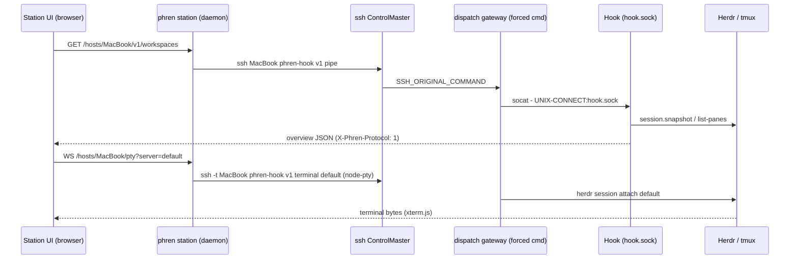

# Phren Station: design

Status: proposal, 2026-10-07. Research in [RESEARCH.md](RESEARCH.md).
Nothing here is built. Sections marked **big build** are new work with no
existing code behind them.

## 1. What it is

Phren Station is the desktop peer of the phone app: one window, on every
computer in the tailnet, that shows every agent session on every computer,
lets you chat with them, type into their terminals and panes, review and
stage their changes, run schedules, read memory and tasks, run the conductor,
and open and edit files in their checkouts. It is a client of the Phren Hook
on each computer, the same way the phone is, with a desktop's keyboard,
screen and multi-pane layout.

In one line: T3 Code's connection runtime and inbox, Moshi's desktop
multi-host pattern, Herdr's sidebar, on Phren's Hook, in Phren's look.

What it is not: it does not own agent processes (T3's thread-owns-process
model), it does not replace Herdr or tmux, it does not go through a cloud
relay, and it does not try to be VS Code.

## 2. Form factor and stack

### Recommendation

Build a **station daemon in TypeScript** (`phren station`, a new workspace
package `@phren/station`, lazily loaded by the CLI like `@phren/agent` and
`@phren/code`) plus a **web UI it serves on loopback**, and wrap that UI in a
**Electron shell** for the app feel (owner decision, 2026-10-09). The
Electron main process starts or attaches to the daemon and loads its UI; it
does not bundle the Hook client logic itself. Ship the daemon first; the
shell is a packaging step. The daemon-served web UI still opens in any
browser too.

```
┌─────────────────────────────────────────────────────────────────────────┐
│  Station app (Electron shell, or any browser on this computer)          │
│  web UI: sessions · chat · terminals · changes · editor · memory · …    │
└───────────────▲─────────────────────────────────────────────────────────┘
                │ http://127.0.0.1:<port>  (per-run token, same-origin WS)
┌───────────────┴─────────────────────────────────────────────────────────┐
│  phren station (node daemon, @phren/station)                            │
│  · /hosts/<computer>/v1/*  → that computer's Hook (HTTP + WS)           │
│  · /hosts/<computer>/pty   → local PTY running ssh -t … v1 terminal     │
│  · merged overview, route lists, reconnect supervisors, caches          │
│  · reuses packages/cli: protocol.ts, client.ts, peers.ts, graph-core    │
└──┬───────────────────────┬───────────────────────┬──────────────────────┘
   │ hook.sock (local)     │ ssh ControlMaster      │ ssh ControlMaster
┌──▼──────────┐      ┌─────▼────────┐        ┌──────▼───────┐
│ Hook, Mini  │      │ Hook, MacBook│        │ Hook, Omarchy│   … NAS
│ herdr/tmux  │      │ herdr/tmux   │        │ herdr/tmux   │
└─────────────┘      └──────────────┘        └──────────────┘
```

### Why this and not the alternatives

| Option | Verdict | Reasons |
| --- | --- | --- |
| **Web UI served by each Hook over Tailscale** | No, not as the base | The Hook listens on a Unix socket only and its whole trust model is SSH. A browser cannot speak SSH, so this needs a TCP listener, a token layer and a PTY WebSocket in every Hook before anything works, and it changes the security story the phone depends on. It also leaves fan-in to the browser. Keep it as a later option for the station daemon itself (section 3.4). |
| **Electron shell over the station daemon** | **Chosen** (owner, 2026-10-09) | Chromium everywhere. On Linux (Omarchy, Wayland) Tauri would render with WebKitGTK, where xterm.js's WebGL renderer and general WebGL behaviour are inconsistent; Electron gives the same Chromium engine on macOS and Linux, so terminals, the 3D memory graph and the editor behave identically on every computer. Native menus, notifications, dock badge and tray come with it. Costs accepted: a 100 to 150 MB installer and an Electron release train. Keep the shell thin: the daemon (on the installed Node, 22.19+, same as the Hook) owns SSH, PTYs and Hook clients, and the shell only starts it and loads its UI, so the same UI still works in a plain browser tab (an iPad or a borrowed laptop on the tailnet). This is T3's own split: its renderer is an ordinary remote client of its server. |
| **Tauri shell over the station daemon** | Not chosen | 10 MB shell, but WKWebView on macOS and WebKitGTK on Linux, so the Linux rendering path differs from the Mac one exactly where the station is heaviest (xterm.js with WebGL, the graph). Moshi ships this shape. |
| **Native SwiftUI Mac app** | No | A third native port of the phone's state machines with no Linux story. |
| **VS Code extension** | No | The existing extension is memory-only over MCP; a fleet UI inside VS Code's sidebar does not fit terminals, chats and multi-pane layouts, and ties the station to one editor. |

Rendering choices inside the UI: **xterm.js** with the WebGL addon and the
canvas fallback (Moshi's choice; T3's libghostty wasm is faster but a
heavier dependency to carry); **Monaco** for the editor and file diffs
(section 5); **`@pierre/diffs`** or the phone's diff rules ported to HTML for
the chat's inline diffs; the existing `packages/cli/browser/graph/` bundle for the
memory graph; plain TypeScript components with the Phren tokens as CSS
variables (section 8). Framework: whatever the first builder is fastest in,
with the constraint that state lives in a small store that the UI tests can
drive without a DOM, as the phone's models do.

## 3. Reaching every computer, and the security model

### 3.1 Identity: a station key per computer, enrolled like a peer

The Hook knows two identities, both SSH: a phone (`phren pair`) and a
computer (`phren bridge enroll-computer` and `phren bridge link`). A station
is a third thing that should look like a computer: it runs on a computer,
it reaches many Hooks, and it never needs the phone's pairing UX.

Decided (owner, 2026-10-09): a separate station key, enrolled on each
computer like a peer and revocable on its own. `phren station enroll` creates `<bridge>/id_ed25519_station` and
prints the restricted line with comment `phren-station:<computer>`; `phren
station link <host>` installs it on each computer over the owner's own SSH
login and pins the host key, exactly as `phren bridge link` does today
(`link.ts`), writing a station-private `<bridge>/station.yaml` peer list
with the same schema as `hooks.yaml`. The forced command stays the existing
`dispatch` gateway, so a station key can do exactly what a phone can:
`pipe`, `web`, `shell`, `terminal`. Nothing new in the Hook's trust boundary.

Why a separate key and not the dispatch key already in `hooks.yaml`: the
dispatch key means "this Hook, acting for a conductor or a schedule";
revocation, audit and the conductor-set rules read it that way. A station
key means "the owner, at a keyboard". They are revocable separately:
removing the `phren-station:<computer>` line from a computer's
`authorized_keys` (a `phren station revoke <computer>` command) cuts that
station off without touching conductor dispatch, schedules or the phone.
For the first spike, a flag can reuse the dispatch key and `hooks.yaml` so
the fleet is reachable on day one (the Mini already links the MacBook,
Omarchy and the NAS).

The local computer's Hook is reached over `hook.sock` with no SSH at all,
as `phren computers` and the Hook's own peer code do.

### 3.2 Transport: one ControlMaster per computer, one exec per request

The Hook answers one HTTP request or one WebSocket per `phren-hook v1 pipe`
exec (`Connection: close`). The phone pools eight channels on one SSH
connection; the station daemon does the same with OpenSSH itself: one
`ssh -o ControlMaster=auto -o ControlPersist=10m` master per computer, each
request a new session on that master, with the same hardening flags the
Hook's `peers.ts` uses (temp `known_hosts` holding only the pinned key,
`StrictHostKeyChecking=yes`, `IdentitiesOnly`, no agent, no forwarding,
`BatchMode=yes`). This is Moshi's `/hosts/<name>/*` proxy and Zed's
ControlMaster reuse. WebSockets (`/v1/overview`, `/v1/transcripts`,
`/v1/status`) are long-lived sessions on the same master.

Terminals: a local PTY (node-pty) running `ssh -t <computer>
phren-hook v1 terminal <server>` (or `v1 shell <folder> [agent]`), bridged to
the UI as a WebSocket of raw bytes with resize frames. Terminal bytes never
pass through the remote Hook, as in Moshi and the phone.

Web previews: `phren-hook v1 web 127.0.0.1 <port>` exec, surfaced as a local
loopback port the UI's preview pane and the system browser can open.

### 3.3 Route lists and reconnect

Copy T3's discipline, which Phren's phone already half does: each computer
has a stable id (the Hook's `computer.id` from `/v1/health`), an ordered
route list (Tailscale MagicDNS name, Tailscale IP, LAN name, LAN IP), learned
from `/v1/health` and `tailscale status`; the supervisor connects over the
first that answers, preflights faster routes every minute and on network
change, and backs off with jitter to five minutes. Per-computer states are
the phone's: Offline (with the Hook's `code`), Busy (health answers, overview
does not), Slow (load or gateway time), Verify (host key changed, connection
stopped). Last-known overviews are cached on disk and shown greyed.

### 3.4 Local UI auth, and reaching a station from elsewhere

The daemon binds `127.0.0.1` with a per-run token in the URL and a CSRF
token for writes, as `phren web-ui` does today. Phase 3 may bind the
Tailscale interface with the token plus `tailscale whois` on each
connection so a browser on another tailnet device can open this computer's
station (Moshi's `--listen 0.0.0.0` with the auth it lacks). Never a
public port.

### 3.5 Hook changes this needs

Nothing for the spike. For the MVP, three small ones:

- A `WebSocket` client cap above 16 per Hook, or a cap per identity, so a
  station with several open chats does not evict the phone's sockets
  (`server.ts`).
- `GET /v1/health` advertising `capabilities.station` once the Hook ships the
  routes below, so the UI gates features per computer like the phone does.
- The restricted-line comment `phren-station:<name>` accepted by the
  installer's key-recognition path (`install.ts`), so updates rewrite it.

## 4. Feature map

Everything the phone does, mapped to what the station reuses. "Hook" means
existing routes; "new" means a route or component to build.

| Area | Phone today | Station | Reuse | New |
| --- | --- | --- | --- | --- |
| Sessions (Agents) | One list across computers, working and needs-input first, computers below, conductor slot, usage rings | A persistent left sidebar: computer → workspace → pane, status rings, unread, pinned; a merged "Needs you" list at the top; keyboard navigation | `WS /v1/overview` per computer, `/v1/workspaces`, `/v1/muxes`, `/v1/resources`, `/v1/usage` | Merge and ordering in the daemon; settle and snooze (T3) kept station-local at first |
| Chat | Transcript, tool cards, approvals, questions, model and effort, permission mode, uploads, worker tree, live preview | Same, in a center pane, several chats in tabs or splits | `WS /v1/transcripts`, `WS /v1/status`, `/v1/prompt` with `deliveryId`, `/v1/keys`, `/v1/upload`, `/v1/approvals/answer`, `/v1/questions/answer`, `/v1/model`, `/v1/settings`, `/v1/agents/permission-mode`, `/v1/subagents` | A TypeScript transcript reducer and tool-card presenter (the phone's are Swift and Kotlin), tested against `fixtures/conformance` |
| Terminals and panes | One PTY at a time, phone key bar | Any number of xterm.js panes; attach a whole Herdr session or tmux server (MVP); attach one pane (phase 2) | `phren-hook v1 terminal`, `v1 shell`; `/v1/workspaces/{create,focus,rename,close,scroll}` | Local PTY bridge (daemon); per-pane `WS /v1/pty` in the Hook (section 6) |
| Changes and Git | Status, log, branches, PRs, tree, worktrees, stage, discard, commit, push, PR; per-file diffs | Same, as a right pane; diff with line comments that become a prompt (T3, Codex app) | `/v1/git/*`, `/v1/diff`, `/v1/files/range`, `/v1/files/resolve` | Comment-to-prompt composer context |
| Code and editor | Read-only viewer, code index dossiers | A built-in VS Code-like editor (section 5) | `/v1/projects/files`, `/v1/files/range`, `/v1/code/*`, `/v1/git/*` | File write with CAS, find in files, Monaco editor |
| Schedules | Store `schedules.yaml` plus Hook run state | Same, with a calendar-ish list per computer | `/v1/schedules`, `/v1/schedules/run`, `/v1/schedules/history`, `/v1/store/file` CAS | — |
| Projects | Grid, add, knobs, skills, launch on a computer | Same, plus "open in editor pane" | `/v1/projects/*`, `/v1/workspaces/launch`, `/v1/harnesses`, `/v1/models` | — |
| Tasks | Store file plus the Hook task contract | Same, with bulk keyboard actions | `/v1/tasks/*`, store CAS | — |
| Memory | Graph, list, files, maintenance; store through GitHub or the Hook | Same; the graph bundle is already JS | `/v1/store/{head,tree,blob,file,delete}`, `packages/cli/browser/graph`, `graph-core` | Store parsers exist in TypeScript already (`content/`, `data/`) |
| Conductor and inbox | Grants, sets, make, stop, dispatch receipts, authority; inbox as a chat card | A real Inbox view (owner inbox across computers) and a Fleet view (sets, grants, capacity, returns) | `/v1/owner-inbox`, `/v1/dispatch*`, `/v1/conductor/*`, `/v1/sets`, `/v1/authority`, `/v1/computers` | Views only |
| Talk | Listen, send, speak, barge-in, read aloud | Phase 3: push-to-talk and read aloud with the Hook's ElevenLabs routes and the browser's speech APIs | `/v1/speech`, `WS /v1/speech/live`, `WS /v1/speech/transcribe` | A web `TalkTurnMachine` port |
| Computers | Health, resources, web servers, simulators, files, Hook health | Same, plus Hook configuration (the phone explicitly skips this) | `/v1/health/details`, `/v1/web-servers`, `/v1/simulators/*`, `/v1/files` | A settings surface over existing CLI commands |
| Notifications | Live Activities, local, APNs, relay | Native desktop notifications from the open overview sockets; an unread ring on the sidebar row and "jump to latest" (cmux) | Overview `approvalPending`, dispatch returns | — |

## 5. Code editing: a light, built-in "own VS Code"

Owner decision, 2026-10-09: a light built-in editor that feels like the
owner's own VS Code, not a link-out and not an embedded VS Code server. Light
means no extension host, no marketplace and no settings sprawl. VS Code-like
means the editor itself, the layout and the keys feel familiar, and it works
on any computer's checkout as if it were local.

**Editor component: Monaco** (MIT, the editor inside VS Code). The earlier
draft picked CodeMirror 6 partly for WebKit; with Electron that reason is
gone, and Monaco gives VS Code's keybindings, multi-cursor, minimap,
find/replace, folding, bracket matching and a built-in side-by-side and
inline **diff editor** for free. It also has a clear path to language
servers later (`monaco-languageclient`). Cost: a few MB in the bundle and its
worker setup, acceptable in Electron. The Phren theme maps onto Monaco's
theme tokens from the shared design tokens.

**Fork VS Code, or build our own?** Build our own around Monaco. A fork
(the Cursor and Windsurf route, or code-server) means rebasing a very large,
fast-moving codebase every month. Forks cannot use Microsoft's extension
marketplace and live on Open VSX. VS Code's workbench is also built around
one workspace on one machine per window, while the station's center is a
fleet: sessions, chats and terminals across computers. Fitting that into a
fork's workbench would fight it at every step. Monaco is the same editor
core VS Code uses, so the typing, keys and diff feel come along for a small
fraction of the cost. A fork only wins on extensions: language packs,
debuggers, linters. If those ever matter more than the fleet, revisit by
embedding an openvscode-server tile per project rather than forking.

**What the editor area does**

```
┌ Explorer ─────────┬ app.ts ● ─ Theme.swift ─ README.md ──────────┬ Outline ──┐
│ ▾ Mac mini        │  1 export function add(a: number, b: …      │ ƒ add     │
│   ▾ phren  main   │  2   return a + b;                          │ ◇ Point   │
│     ▸ packages    │  3 }                                        │   ƒ length│
│     ▸ docs   M    │  4                                          │ ◇ Axis    │
│ ▸ MacBook         │  5 export class Point {                     │           │
│ ▸ Omarchy         │  …                                          │           │
├ Source control ───┤──────────────────────────────────────────────┤           │
│ M App.swift +2 −2 │ Terminal · Mac mini · phren                  │           │
│ [Stage] [Commit]  │ $ pnpm test                                  │           │
└───────────────────┴──────────────────────────────────────────────┴───────────┘
 ⌘P quick open · ⇧⌘F find in files · ⌘⇧O symbol · F12 definition · ⇧F12 references
```

- **Explorer**: computer → project → tree, from `/v1/projects/files` and
  `/v1/code/tree`, with git decorations from `/v1/git/status` and the code
  index's change chips. Projects come from `/v1/projects/locate` and the
  sessions already open, so every agent's checkout is one click away.
- **Tabs and splits**: editor tabs with dirty dots, split right and down,
  preview tabs on single click, reopen closed tab, all inside the station's
  tiled layout so a file, its agent's chat and its terminal sit together.
- **Quick open (⌘P)**: fuzzy file names from `/v1/code/files` when the
  index is on, else a new bounded file list route. **Go to symbol (⌘⇧O,
  ⌘T)**: `/v1/code/outline` and `/v1/code/search`.
- **Find in files (⇧⌘F)**: a new Hook route running ripgrep in the
  repository, bounded in results, time and bytes, respecting `.gitignore`.
  Replace across files applies through the write route, one CAS write per
  file.
- **Definitions and references (F12, ⇧F12)**: Monaco definition and
  reference providers backed by `/v1/code/definition` and
  `/v1/code/references`; hover shows the dossier's linked findings, which no
  other editor can do.
- **Source control panel**: the existing git routes (status, stage, unstage,
  discard, commit, push, PR); clicking a changed file opens Monaco's diff
  editor against HEAD with hunk stage and revert.
- **Integrated terminal**: the station's terminal tile opened in the
  project's folder on that computer (`phren-hook v1 shell <folder>`) or the
  pane where its agent runs.
- **Agent hand-off**: "Ask agent" on a selection, a diff hunk or a line
  sends it as typed composer context to the session working in that
  checkout; "Remember this" saves a finding through `POST /v1/code/note`.
  An agent's edits show up live in an open file (reload when unchanged,
  a conflict banner when both changed).
- **Preview**: Markdown preview, images, and dev servers through the
  existing `phren-hook v1 web` relay.

**Hook routes this needs**

- **File write with compare-and-swap**: `PUT /v1/projects/files`, body
  `{project | target, path, content, version}` where `version` is the stat
  token `/v1/files/range` already returns (`file-range.ts`); 409 when the
  file moved on disk. Create, rename and delete as explicit operations.
  Bounded like uploads, scoped to a located project or the pane's
  repository, never through a symlink, never inside `.git`. Recorded edits
  trigger the code index's 500 ms refresh. **This is the Hook's first
  checkout write surface and must be reviewed as such.**
- **Find in files**: `POST /v1/projects/search` (ripgrep, bounded).
- **File list for quick open** when the code index is off.
- **Change notifications** for open files: start by piggybacking on the
  overview tick and `/v1/git/status`; a file-watch stream only if that is
  too slow.

**Not in scope**: extensions, debugging, notebooks, settings sync, remote
containers. **LSP** (diagnostics, completion, rename) is phase 3 at the
earliest: a Hook WebSocket that runs a language server per project and
proxies its stdio, consumed by `monaco-languageclient`. It is a **big
build** (process lifetime, per-language installs, memory). "Open in VS
Code / Zed / Cursor" (`vscode://vscode-remote/ssh-remote+<host><path>`)
stays as an escape hatch; the embedded openvscode-server option is dropped.

## 6. Multi-machine terminal multiplexing

The problem: Herdr's socket has no raw output stream, tmux has
`capture-pane`, and the Hook exposes neither. The phone solves it with an SSH
PTY that attaches the whole multiplexer. The station needs that plus
per-pane terminals side by side.

**MVP**: attach whole servers. One xterm.js pane runs `ssh -t <computer>
phren-hook v1 terminal <server>` through the daemon's PTY bridge; the
Herdr client TUI or tmux appears in it with its own key bindings. Several
computers' Herdr clients can sit in a grid. `phren-hook v1 shell <folder>
[agent]` gives a plain shell or a fresh agent in a project folder when there
is no multiplexer.

**Phase 2: per-pane terminals, a new Hook route.** `WS /v1/pty?server=&pane=&cols=&rows=`
backed by a new `TerminalProvider` method:

- Herdr: `herdr terminal session control <pane> --takeover` is a
  bidirectional JSON bridge documented "for third-party UIs"; `observe` is
  the read-only form. Wrap it in the provider.
- tmux: a child PTY running a linked session on the pane's window
  (`tmux new-session -t <session> \; select-window -t <window>` with the
  status line off), or `pipe-pane` for read-only.
- Frames: raw bytes down, bytes and `{resize}` up; identity validated as
  every pane route is (`validateTarget`); refused while the pane's agent is
  "unknown", like `/v1/keys`.

This route makes a per-pane terminal available to the phone too, and
removes the "attach the whole server" awkwardness there. It is the biggest
piece of Hook work in the plan and should be its own PR with
`terminal-herdr` and `terminal-tmux` integration tests.

**Layout**: the window is a sidebar plus a tiled area. Tiles are chats,
terminals, diffs, files, the graph, a preview. Layouts are saved per
computer set, like Herdr's layout snapshots and the Code tab's drag-and-drop
panes. Keyboard: a command palette across computers (Moshi's Cmd-K), "jump
to latest unread", and a session switcher.

```
┌ Phren Station ───────────────────────────────────────────────────────────────┐
│ ▣ Projects  ▣ Agents  ▣ Tasks  ▣ Memory  ▣ Inbox                     ⌘K  ⚙  │
├────────────────┬─────────────────────────────────┬───────────────────────────┤
│ NEEDS YOU · 1  │ ✳ phren  ⑂ main  Mac mini  2m   │ Changes · phren           │
│ ● mina  linux… │ Ship the onboarding flow        │ M Sources/App.swift +2 −2 │
│                │─────────────────────────────────│ ┌ @@ −2,3 +2,3 @@ ─────── │
│ WORKING · 2    │ › Pick up the onboarding flow…  │ │ 3 − let accent = green  │
│ ● phren  Mac…  │ Picking it up. The welcome…     │ │ 3 + let accent = purple │
│ ● hub  Omarchy │ ▸ Read  shots/home.png     ✓    │ └──────────────────────── │
│                │ ▸ Patch Theme.swift        ✓    │ [Stage] [Discard] [Commit]│
│ IDLE · 2       │ ▸ Shell swift test …       ✓    ├───────────────────────────┤
│ ○ mina  linux… │                                 │ Terminal · Mac mini       │
│ ○ phren  Mac…  │ ┌ Codex asks ─────────────────┐ │ $ swift test --filter …   │
│                │ │ Push the release branch     │ │ Test Suite 'All' passed   │
│ COMPUTERS      │ │ ◯ Approve  ◯ Allow project  │ │ ▌                         │
│ ■ Mac mini     │ │ ◯ Allow everywhere  ◯ Deny  │ │                           │
│ ■ MacBook      │ └─────────────────────────────┘ │                           │
│ ■ Omarchy      │ Message Codex…        🎙  ⬆     │                           │
│ ■ NAS  offline │                                 │                           │
└────────────────┴─────────────────────────────────┴───────────────────────────┘
```

## 7. How it reaches sessions, end to end



Agent status, approvals and transcripts keep flowing from the harness hooks
into the Hook exactly as today; the station only subscribes.

## 8. Sharing with the iOS and Android apps

What can be shared without a rewrite, in order of payoff:

1. **The wire contract and fixtures.** The station's client tests run
   against `fixtures/conformance/` (Codex and Copilot backlogs, hook events,
   remote agent children, task contract) the same way PhrenKit's do. Any new
   fixture the station needs lands in the CLI first, as the apps' AGENTS.md
   already requires.
2. **Design tokens as data.** Export the phone's palettes (`PhrenAppearance`
   palettes and `PhrenThemeColors`) to a `design/tokens.json` in the apps
   repo, consumed by the station as CSS variables and by the phone's custom
   theme editor. Spacing, radii, row heights and the state colors are the
   same numbers (section 11 of the research).
3. **The graph.** Already one bundle for four surfaces; the station uses it
   as is.
4. **A shared TypeScript kit, `@phren/kit`** (**big build**, but the one that
   pays): the Hook client with route list and reconnect supervisor, the
   overview merge and ordering, offline and busy policy, delivery
   reconciliation, the transcript reducer and tool-card model, usage merging.
   The station uses it directly. The phones keep their Swift and Kotlin
   ports but the kit becomes the reference implementation whose fixtures
   they must match, which is the repo's stated model for the graph. Lifting
   it is the only way the three clients stop drifting.
5. **Design docs.** `apps/ios/design/*.md` are the shared spec today; the
   station adds `docs/station/design/*` for desktop-only contracts (layout,
   keyboard, tiles) and defers to the phone docs for cards, chat and
   controls.

What stays native on the phone and is not shared: push, Live Activities,
the Apple and Whisper speech stacks, haptics, the touch control kit, Siri and
widgets.

## 9. Look and feel

The station is Phren, not a generic dev tool. Concretely:

- Charcoal canvas `#1E1E1E`, surfaces `#282A2C` and `#3C3F42`, lavender accent
  `#B994F4`, amber `#E0BC7F` for "needs you", green `#8AC8AC` for done, host
  colors for computers. The five phone themes and the custom editor's slots,
  from the shared tokens.
- The same session row: provider glyph in a status ring, project in
  lavender, branch in monospace, computer in its host color, age, title
  below, pin, left accent bar. The same section labels in small caps with
  counts. The same tool cards, approval cards and activity line in chat.
- Pill clusters for toolbars; 10 px card radius; 44 px rows (desktop may use
  36 px in dense lists, kept as a token); 0.18 s easing; no decorative
  motion; the mascot only on empty states and the welcome.
- Monospaced transcript in JetBrains Mono or the system mono; chat text white
  and grey whatever the theme.
- Plain language in every label and error, the way the App Store copy reads.

## 10. MVP cut and phases

### Phase 0, spike (one to two weeks)

`phren station` daemon reusing the dispatch key and `hooks.yaml`: `/hosts/<c>/v1/*`
proxy with ControlMaster, the PTY bridge, a merged overview over the
existing `WS /v1/overview` sockets, and a UI with the sidebar, one chat pane
(transcript, status, prompt, keys, approvals, questions) and one terminal
tile. Runs in a browser tab. Proves the transport and the 16-socket budget.

### Phase 1, MVP

Everything the phone's Agents tab does, at a desk:

- Station key and `phren station link`; route lists and reconnect states;
  disk cache of last-known overviews.
- Sessions sidebar with Needs you, Working, Idle, Computers; pin; rename;
  close; launch (role, harness, model, effort, worktree) from a project or a
  computer.
- Chat with several tabs, uploads, model and effort, permission mode,
  worker tree, live preview, delivery reconciliation.
- Terminals: whole-server attach tiles, shells and agents in a folder, web
  preview ports.
- Changes: status, diff, stage, discard, commit, push, PR; worktrees list.
- The editor, first cut: explorer, tabs, quick open, go to symbol,
  definitions and references from the code index, Monaco diff for changed
  files, and saving through the new CAS write route. Find in files and
  replace follow in phase 2.
- Computers: health, resources, usage rings, web servers.
- Memory and Tasks read views (the graph, findings, tasks) and task status
  updates over the store CAS routes.
- Native notifications for approvals and dispatch returns.
- Electron shell with menus, dock badge and a tray count, starting or
  attaching to the daemon; `phren station` also opens the browser when the
  shell is absent.

Not in the MVP: find in files, per-pane PTYs, talk, schedules editing,
conductor grants and authority views, simulators, settle and snooze.

### Phase 2, editor and panes

- Editor, second cut: find in files and replace (`POST /v1/projects/search`),
  splits, create, rename and delete, Markdown preview, "Ask agent" on a
  selection, live reload of agent edits with a conflict banner.
- `WS /v1/pty` per pane in the Hook (Herdr control bridge, tmux linked
  session); per-pane terminal tiles; saved layouts per set.
- Line comments to prompt; schedules editor; conductor Fleet and Inbox
  views; grants and authority; simulators tile.
- Settle and snooze for sessions, station-local.

### Phase 3, shared kit and reach

- `@phren/kit` extraction and fixture-backed parity with the phones; design
  tokens as data in the apps repo.
- Talk mode in the browser with the Hook's ElevenLabs routes.
- Station reachable from other tailnet devices (Tailscale identity plus
  token).
- Optional: an LSP proxy route for diagnostics, completion and rename
  through `monaco-languageclient`, if the editor earns it.

### Big builds, flagged

| Item | Why it is big | Where |
| --- | --- | --- |
| Station daemon and proxy | New package, SSH process management, PTY bridge, caches | Phase 0 to 1 |
| TypeScript chat reducer and tool cards | The phone's largest feature, exists only in Swift and Kotlin | Phase 1 |
| Per-pane `WS /v1/pty` | New provider method on Herdr and tmux, lifetime and resize semantics, tests | Phase 2 |
| File write route | The Hook's first checkout write surface; needs the same care as staging | Phase 1 |
| Built-in editor | Explorer, tabs, quick open, Monaco providers over the code index, diff, conflicts with agent edits | Phase 1 to 2 |
| `@phren/kit` extraction | Touches the CLI, the station and the apps' parity process | Phase 3 |
| LSP proxy | Process lifetime per project and language on the remote | Later, if at all |

## 11. Risks and open questions

- **The 16 WebSocket cap** per Hook is shared with the phone; the daemon
  must budget (one overview per computer, transcripts only for focused
  chats) and the Hook should raise or scope the cap.
- **Gateway cost per request**: each `pipe` exec forks `socat` or a node
  gateway; `gatewayMs` in health reports it. ControlMaster removes the SSH
  handshake but not the fork. A busy station may want a long-lived pipe
  variant (`phren-hook v1 stream`) later; not needed to start.
- **Electron weight and drift**: installer size and Chromium security
  updates are an ongoing cost. Keep all logic in the daemon so the shell
  stays a thin, replaceable loader, and keep the browser path working as
  the fallback.
- **Herdr's control bridge** is documented but unverified here; the tmux
  linked-session approach is well understood. Prove both in the Phase 2
  spike before committing to the route shape.
- **Store sync**: the station writes memory and tasks through the Hook's CAS
  routes like the phone; it must not also run the CLI's own store writers in
  the same process, or two writers race on one working tree.
- **Scope creep toward owning agents**: every reference product that owns
  the agent process ends up with 7k-line adapters. The station must keep
  the harness transcript and the pane as truth and stay a client.

## 12. Decisions needed from the owner

1. **Shell**: decided 2026-10-09: Electron over the station daemon, for
   consistent Chromium rendering of xterm.js and WebGL on Linux. The
   daemon-served UI still opens in a browser.
2. **Identity**: decided 2026-10-09: a separate station key, enrolled on
   each computer like a peer and revocable on its own; the dispatch key
   and `hooks.yaml` are reused only by the phase 0 spike.
3. **Editor scope**: decided 2026-10-09: a light built-in editor that feels
   like the owner's own VS Code (Monaco, explorer, tabs, quick open, find
   in files, code-index navigation, diff, terminal), with a new Hook write
   route; link-out stays as an escape hatch.
